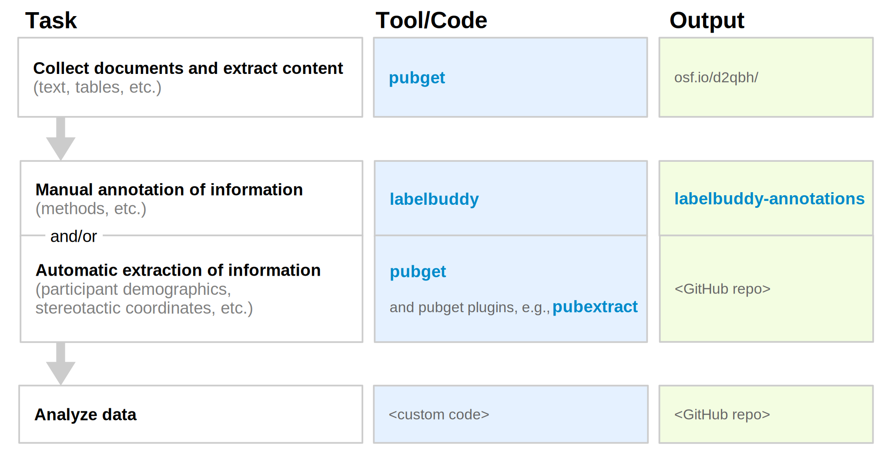

# Literature mining

Here's our suggested workflow for meta-research, along with the tools and output locations that we've developed. 

**Figure explanation:**
- Our tool [**pubget**](https://neuroquery.github.io/pubget/pubget.html) performs the tasks of collecting documents and extracting content
- The corpera created by pubget can be stored in a dedicated [**OSF project**](https://osf.io/d2qbh/).
- Our tool [**labelbuddy**](https://jeromedockes.github.io/labelbuddy/labelbuddy/current/), can be used to manually annotate papers.
- We have an open repository of [**labelbuddy annotations**](https://litmining.github.io/labelbuddy-annotations/overview.html), where researchers can re-use, update, and add new annotations.
- Our tools [**pubget**](https://neuroquery.github.io/pubget/pubget.html), and [**pubextract**](https://github.com/neurodatascience/pubextract) can be used to automatically extract information.
- For the step of analyzing the data, each project would have its own code ("custom code"), which we hope would be tracked and shared in its own repository on GitHub or elsewhere ("GitHub repo").

<!-- ## Steps for using our tools in a literature-mining project
### Collect documents and extract content: pubget

### Manually annotate information: labelbuddy

### Automatically extract information: pubget and pubextract

### Analyse data: Custom code

### Store outputs: OSF project and labelbuddy-annotations -->

